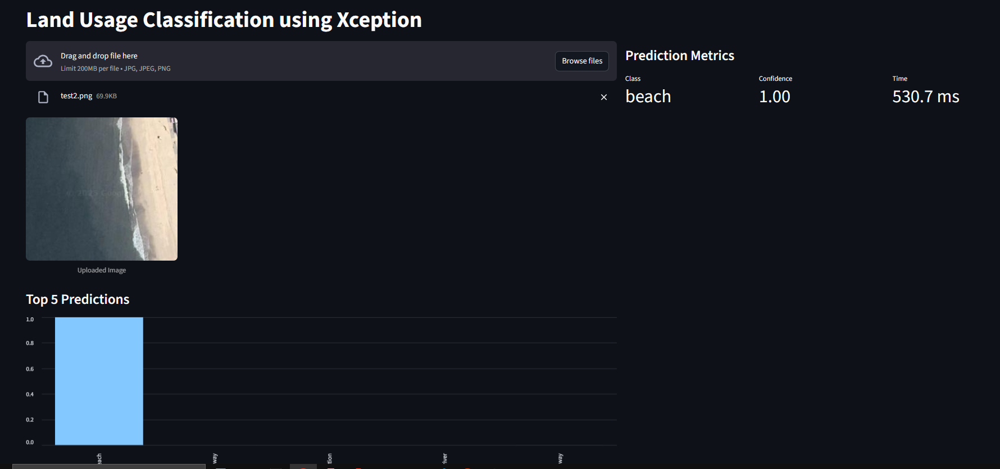

# Land Usage Scene Classification on Streamlit

- Created a simple GUI to deploy on streamlit for Land Usage Scene Classification
- You can upload an image and get prediction
- It has currently **89%** precision
- You can find the whole project [Here](https://github.com/MBJ-2002/LUSC-with-Xception)
- Screenshot

